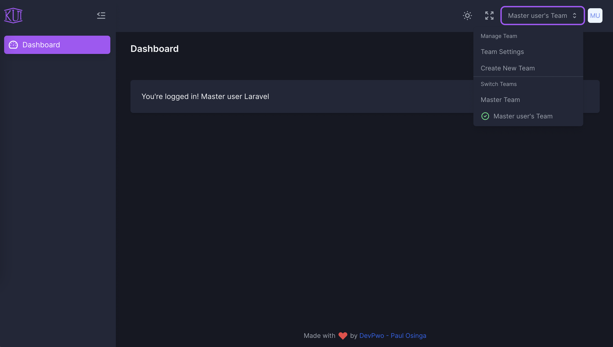
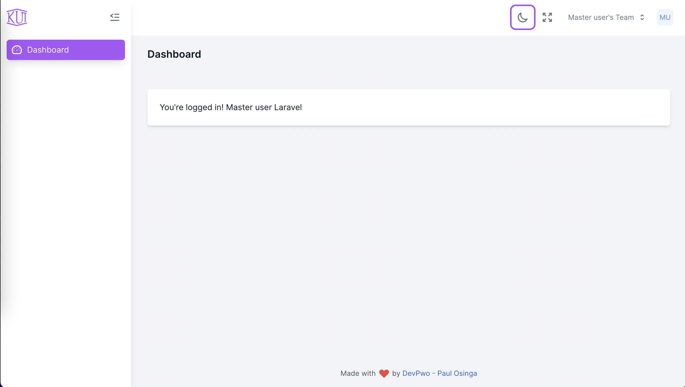

## Base panel Laravel-jetsctream with sidebar, roles and permissions

[]: # Base: Inertial

## Installation

```bash
composer install
copy .env.example .env
php artisan key:generate
php artisan migrate
php artisan db:seed
npm i

```

## Run Server dev and hot reload

```bash
npm run dev
php artisan serve
```

## Run Pint

```bash
./vendor/bin/pint --test -v 
```

## Run and fix Pint

```bash
./vendor/bin/pint
```

## Sidebar jetstream panel power by kamona/kui-laravel-jetstream

```bash
Sidebar links resources/js/Components/Sidebar/SidebarContent.vue
```

#### Screens

|                                     |                                    |
| ----------------------------------- | ---------------------------------- |
|    |    |